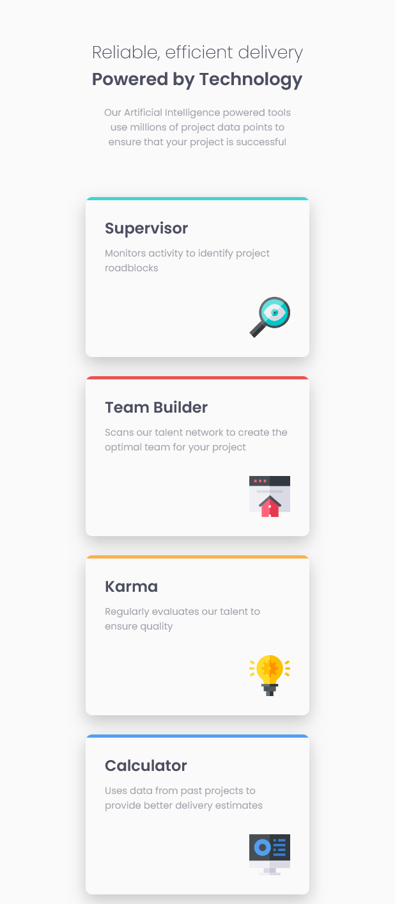

# Frontend Mentor - Four card feature section solution

This is a solution to the [Four card feature section challenge on Frontend Mentor](https://www.frontendmentor.io/challenges/four-card-feature-section-weK1eFYK). 

## Table of contents

- [Frontend Mentor - Four card feature section solution](#frontend-mentor---four-card-feature-section-solution)
  - [Table of contents](#table-of-contents)
  - [Overview](#overview)
    - [Screenshot](#screenshot)
    - [Links](#links)
  - [My process](#my-process)
    - [Built with](#built-with)
    - [What I learned](#what-i-learned)
    - [Continued development](#continued-development)
  - [Author](#author)

## Overview

### Screenshot

    The desktop design VS My desktop solution
     
    
    

 

    The mobile design VS My mobile solution
     
    
    

### Links

- Solution URL: [FrontEnd Mentor: My solution](https://www.frontendmentor.io/solutions/four-card-solution--6El3CBx3N)
- Live Site URL: [GitHub Page: My solution](https://andresssg.github.io/Four-Card/)

## My process

### Built with

- Semantic HTML5 markup
- CSS custom properties
- Flexbox, Grid

### What I learned

I could put on practice my css grid knowledge and how to make a responsive design with CSS GRID.

### Continued development

I want to continue making responsive components to incorporate them into other projects and someday make a fully responsive website.

## Author

- Frontend Mentor - [@Andresssg](https://www.frontendmentor.io/profile/Andresssg)